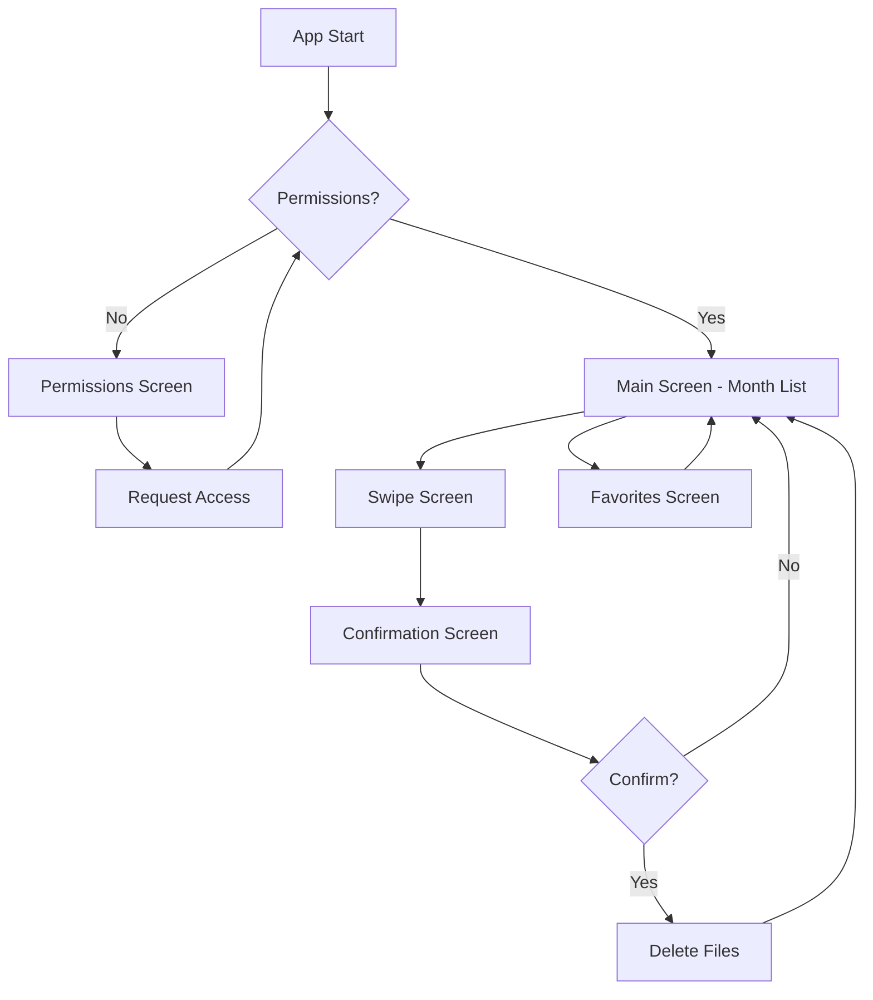

# Design Document: SwipeShot Mobile App

## Overview

SwipeShot — это кроссплатформенное мобильное приложение (iOS/Android), построенное на React Native с использованием Expo Managed Workflow. Приложение предоставляет интуитивный swipe-интерфейс в стиле Tinder для быстрой сортировки фотографий и видео из галереи устройства.

### Ключевые технологии

- **React Native** (Expo SDK 50+) — кроссплатформенная разработка
- **Expo Managed Workflow** — упрощенная сборка и деплой
- **Zustand** — легковесное управление состоянием
- **react-native-reanimated v3** — нативные анимации 60fps
- **expo-media-library** — доступ к галерее устройства
- **Expo Router** — файловая навигация

### Архитектурные приоритеты

1. **App Store Compliance** — дизайн учитывает все требования модерации Apple/Google
2. **Performance 60fps** — все анимации работают на нативном потоке
3. **Memory Efficiency** — оптимизация для устройств с ограниченной памятью
4. **Offline-First** — приложение работает без интернета

## Architecture

### High-Level Architecture

```
┌─────────────────────────────────────────────────────────────┐
│                        UI Layer                              │
│  (Expo Router Screens + React Native Components)            │
└────────────────┬────────────────────────────────────────────┘
                 │
┌────────────────▼────────────────────────────────────────────┐
│                   State Management Layer                     │
│              (Zustand Store + Persistence)                   │
└────────────────┬────────────────────────────────────────────┘
                 │
┌────────────────▼────────────────────────────────────────────┐
│                    Business Logic Layer                      │
│  (Hooks: useGallery, useSwipe, useFilters, useAnimations)   │
└────────────────┬────────────────────────────────────────────┘
                 │
┌────────────────▼────────────────────────────────────────────┐
│                     Native APIs Layer                        │
│     (expo-media-library, expo-file-system, AsyncStorage)    │
└─────────────────────────────────────────────────────────────┘
```

### Структура проекта

```
app/
├── (tabs)/                    # Tab-based navigation
│   ├── index.tsx             # Главный экран (список месяцев)
│   ├── favorites.tsx         # Экран избранного
│   └── _layout.tsx           # Tab layout
├── swipe/
│   └── [monthId].tsx         # Экран свайпа для конкретного месяца
├── confirmation/
│   └── [monthId].tsx         # Экран подтверждения удаления
├── permissions.tsx           # Экран запроса разрешений
└── _layout.tsx               # Root layout

components/
├── SwipeCard.tsx             # Карточка с фото/видео
├── MonthCard.tsx             # Карточка месяца на главном экране
├── ConfirmationList.tsx      # Список файлов к удалению
├── FilterBar.tsx             # Панель фильтров
├── ProgressIndicator.tsx     # Индикатор прогресса
└── EmptyState.tsx            # Пустые состояния

hooks/
├── useGallery.ts             # Загрузка и группировка медиафайлов
├── useSwipeGesture.ts        # Обработка жестов свайпа
├── useCardAnimation.ts       # Анимации карточек
├── useFilters.ts             # Логика фильтров
├── usePermissions.ts         # Управление разрешениями
└── usePersistence.ts         # Сохранение/восстановление состояния

store/
└── photoStore.ts             # Zustand store

utils/
├── groupByMonth.ts           # Группировка по месяцам
├── detectScreenshot.ts       # Определение скриншотов
├── formatFileSize.ts         # Форматирование размера файлов
└── constants.ts              # Константы приложения

types/
└── index.ts                  # TypeScript типы
```

### Навигационная структура



### Legal & Privacy

Пункт **"Privacy Policy"** доступен из основного интерфейса (например, кнопка в хедере главного экрана).  
При нажатии открывается внешний URL через `Linking.openURL`.  
Если URL не задан, показываем понятное сообщение и не падаем.

## Components and Interfaces

### Core Components

#### 1. SwipeCard Component

Основной компонент для отображения и свайпа медиафайлов.

```typescript
interface SwipeCardProps {
  mediaItem: MediaItem;
  onSwipeLeft: (item: MediaItem) => void;
  onSwipeRight: (item: MediaItem) => void;
  onSwipeUp: (item: MediaItem) => void;
  isScreenshot: boolean;
  fileSize?: number;
}
```

**Ответственность:**
- Отображение превью фото/видео
- Обработка жестов (PanGestureHandler)
- Анимация карточки (rotation, translation, opacity)
- Визуальные индикаторы (скриншот, размер файла)

**Performance критично:**
- Использует `react-native-reanimated` worklets
- Все вычисления на UI thread
- Мемоизация через `React.memo`

#### 2. MonthCard Component

Карточка месяца на главном экране.

```typescript
interface MonthCardProps {
  month: string;           // "2024-01"
  photoCount: number;
  coverPhoto: string;      // URI первого фото
  onPress: () => void;
}
```

#### 3. ConfirmationList Component

Список файлов для подтверждения удаления.

```typescript
interface ConfirmationListProps {
  items: MediaItem[];
  totalSize: number;
  onConfirm: () => Promise<void>;
  onCancel: () => void;
}
```

**Оптимизация:**
- Использует `FlatList` с виртуализацией
- `keyExtractor` для стабильных ключей
- `getItemLayout` для фиксированной высоты элементов

### Custom Hooks

#### useGallery Hook

```typescript
interface UseGalleryReturn {
  months: MonthSession[];
  isLoading: boolean;
  error: Error | null;
  refetch: () => Promise<void>;
}

function useGallery(): UseGalleryReturn
```

**Логика:**
1. Запрашивает все медиафайлы через `expo-media-library`
2. Группирует по месяцам (функция `groupByMonth`)
3. Сортирует от новых к старым
4. Кэширует результат

#### useSwipeGesture Hook

```typescript
interface UseSwipeGestureReturn {
  gestureHandler: GestureType;
  animatedStyle: AnimatedStyleProp<ViewStyle>;
  isAnimating: boolean;
}

function useSwipeGesture(
  onSwipeLeft: () => void,
  onSwipeRight: () => void,
  onSwipeUp: () => void
): UseSwipeGestureReturn
```

**Логика:**
- Использует `PanGestureHandler` из `react-native-gesture-handler`
- Вычисляет `translationX`, `translationY`, `rotation`
- Определяет направление свайпа по threshold (150px)
- Анимирует возврат карточки при отмене жеста

#### useCardAnimation Hook

```typescript
interface UseCardAnimationReturn {
  translateX: SharedValue<number>;
  translateY: SharedValue<number>;
  rotate: SharedValue<number>;
  opacity: SharedValue<number>;
  animateSwipe: (direction: 'left' | 'right' | 'up') => void;
  resetCard: () => void;
}

function useCardAnimation(): UseCardAnimationReturn
```

**Анимации:**
- Spring animation для возврата карточки
- Timing animation для свайпа
- Все анимации используют `useSharedValue` и `useAnimatedStyle`
- Работают на UI thread (60fps гарантировано)

#### useFilters Hook

```typescript
interface UseFiltersReturn {
  activeFilter: FilterType;
  setFilter: (filter: FilterType) => void;
  filteredItems: MediaItem[];
}

type FilterType = 'all' | 'screenshots' | 'large-videos';

function useFilters(items: MediaItem[]): UseFiltersReturn
```

**Логика фильтрации:**
- Screenshots: проверка по имени файла, пути, размерам
- Large videos: размер > 50MB

## Data Models

### MediaItem

```typescript
interface MediaItem {
  id: string;                    // Уникальный ID из expo-media-library
  uri: string;                   // Локальный URI файла
  filename: string;              // Имя файла
  mediaType: 'photo' | 'video';
  width: number;
  height: number;
  creationTime: number;          // Unix timestamp
  modificationTime: number;
  duration: number;              // Для видео (секунды)
  fileSize: number;              // Байты
  albumId?: string;
}
```

### MonthSession

```typescript
interface MonthSession {
  id: string;                    // "2024-01"
  displayName: string;           // "Январь 2024"
  items: MediaItem[];
  totalCount: number;
  coverPhotoUri: string;         // URI первого фото для превью
  currentIndex: number;          // Текущая позиция пользователя
}
```

### AppState (Zustand Store)

```typescript
interface AppState {
  // Галерея
  months: MonthSession[];
  isLoadingGallery: boolean;
  galleryError: Error | null;
  
  // Текущая сессия
  currentMonthId: string | null;
  currentIndex: number;
  
  // Очереди
  deletionQueue: MediaItem[];
  safeItems: MediaItem[];
  favorites: MediaItem[];
  
  // Фильтры
  activeFilter: FilterType;
  
  // Permissions
  hasMediaLibraryPermission: boolean;
  
  // Actions
  loadGallery: () => Promise<void>;
  setCurrentMonth: (monthId: string) => void;
  addToDeletionQueue: (item: MediaItem) => void;
  addToSafe: (item: MediaItem) => void;
  addToFavorites: (item: MediaItem) => void;
  confirmDeletion: () => Promise<void>;
  setFilter: (filter: FilterType) => void;
  nextItem: () => void;
  saveState: () => Promise<void>;
  loadState: () => Promise<void>;
}
```

### Persistence Schema

Сохраняется в AsyncStorage:

```typescript
interface PersistedState {
  version: number;               // Версия схемы для миграций
  deletionQueue: string[];       // Массив ID
  safeItems: string[];
  favorites: string[];
  monthProgress: {               // Прогресс по месяцам
    [monthId: string]: number;   // currentIndex
  };
  lastSync: number;              // Timestamp последней синхронизации
}
```

### Filter Detection Logic

#### Screenshot Detection

```typescript
function isScreenshot(item: MediaItem): boolean {
  // 1. Проверка имени файла
  const screenshotPatterns = [
    /screenshot/i,
    /screen_shot/i,
    /снимок экрана/i,
    /скриншот/i
  ];
  
  const matchesFilename = screenshotPatterns.some(
    pattern => pattern.test(item.filename)
  );
  
  // 2. Проверка пути (iOS: Screenshots album)
  const matchesPath = item.uri.includes('Screenshots');
  
  // 3. Проверка aspect ratio (обычно совпадает с экраном)
  const aspectRatio = item.width / item.height;
  const isPhoneAspectRatio = 
    (aspectRatio >= 0.45 && aspectRatio <= 0.6) ||  // Portrait
    (aspectRatio >= 1.7 && aspectRatio <= 2.2);     // Landscape
  
  return matchesFilename || matchesPath;
}
```

#### Large Video Detection

```typescript
function isLargeVideo(item: MediaItem): boolean {
  const LARGE_VIDEO_THRESHOLD = 50 * 1024 * 1024; // 50 MB
  return item.mediaType === 'video' && item.fileSize > LARGE_VIDEO_THRESHOLD;
}
```

### Grouping Algorithm

```typescript
function groupByMonth(items: MediaItem[]): MonthSession[] {
  // 1. Сортировка по дате (новые первые)
  const sorted = [...items].sort((a, b) => 
    b.creationTime - a.creationTime
  );
  
  // 2. Группировка по месяцам
  const grouped = new Map<string, MediaItem[]>();
  
  sorted.forEach(item => {
    const date = new Date(item.creationTime);
    const monthKey = `${date.getFullYear()}-${String(date.getMonth() + 1).padStart(2, '0')}`;
    
    if (!grouped.has(monthKey)) {
      grouped.set(monthKey, []);
    }
    grouped.get(monthKey)!.push(item);
  });
  
  // 3. Преобразование в MonthSession
  return Array.from(grouped.entries()).map(([monthKey, items]) => ({
    id: monthKey,
    displayName: formatMonthName(monthKey),
    items,
    totalCount: items.length,
    coverPhotoUri: items[0].uri,
    currentIndex: 0
  }));
}
```

## Correctness Properties


*A property is a characteristic or behavior that should hold true across all valid executions of a system-essentially, a formal statement about what the system should do. Properties serve as the bridge between human-readable specifications and machine-verifiable correctness guarantees.*

### Property 1: Gallery loading completeness

*For any* set of media files in device gallery, when permission is granted, the Gallery_Service should load all photos and videos without omission.

**Validates: Requirements 1.3**

### Property 2: Month grouping correctness

*For any* set of media items with different creation dates, the Gallery_Service should group them by month (YYYY-MM format) and sort months from newest to oldest.

**Validates: Requirements 1.4, 4.1**

### Property 3: Swipe direction mapping

*For any* media item, swiping right should add it to Safe_Items, swiping left should add it to Deletion_Queue, and swiping up should add it to Favorites_Collection.

**Validates: Requirements 2.1, 2.2, 2.3**

### Property 4: Session navigation

*For any* position in a Monthly_Session, completing a swipe should increment the current index by 1 and display the next media item.

**Validates: Requirements 2.5**

### Property 5: Card reset on incomplete swipe

*For any* card position during drag, releasing without reaching the swipe threshold should animate the card back to position (0, 0) with original rotation.

**Validates: Requirements 3.2**

### Property 6: Card disappearance on complete swipe

*For any* completed swipe in direction D (left/right/up), the card should animate to opacity 0 while moving in direction D.

**Validates: Requirements 3.3**

### Property 7: Next item preloading

*For any* media item being animated, the next item in the session should be preloaded before the animation completes.

**Validates: Requirements 3.5**

### Property 8: Session completion navigation

*For any* Monthly_Session, when the last media item is swiped, the app should automatically navigate to the Confirmation_Screen.

**Validates: Requirements 4.4**

### Property 9: Deletion queue display

*For any* Deletion_Queue state, the Confirmation_Screen should display all items from the queue with their previews.

**Validates: Requirements 5.1, 5.2**

### Property 10: Deletion confirmation action

*For any* non-empty Deletion_Queue, confirming deletion should remove all queued items from device gallery.

**Validates: Requirements 5.3**

### Property 11: Deletion cancellation

*For any* Deletion_Queue state, canceling deletion should leave all files untouched and navigate back to the month list.

**Validates: Requirements 5.4**

### Property 12: Storage calculation accuracy

*For any* set of media items in Deletion_Queue, the displayed total size should equal the sum of all individual file sizes.

**Validates: Requirements 5.5**

### Property 13: Screenshot detection

*For any* media item with filename matching screenshot patterns (e.g., "screenshot", "screen_shot") or path containing "Screenshots", it should be identified as a screenshot.

**Validates: Requirements 6.1**

### Property 14: Filter display correctness

*For any* active filter (screenshots/large-videos), only media items matching the filter criteria should be displayed in the session.

**Validates: Requirements 6.3, 7.3**

### Property 15: Visual indicators for filtered items

*For any* media item identified as screenshot or large video, the card should display the corresponding visual indicator.

**Validates: Requirements 6.2, 7.2**

### Property 16: Large video identification

*For any* video file with size > 50MB, it should be identified as a large video.

**Validates: Requirements 7.1**

### Property 17: Large video total size calculation

*For any* Monthly_Session, the displayed total size of large videos should equal the sum of all videos > 50MB in that session.

**Validates: Requirements 7.4**

### Property 18: System theme adaptation

*For any* system color scheme change (light/dark), the app should update its theme to match the system setting.

**Validates: Requirements 8.4**

### Property 19: Favorites album creation

*For any* first media item added to Favorites_Collection, the app should create an album named "SwipeShot Favorites" in device gallery if it doesn't exist.

**Validates: Requirements 9.1**

### Property 20: Favorites album addition

*For any* media item added to Favorites_Collection, it should be added to the "SwipeShot Favorites" album in device gallery.

**Validates: Requirements 9.2**

### Property 21: Favorites display completeness

*For any* Favorites_Collection state, the favorites screen should display all media items in the collection.

**Validates: Requirements 9.3**

### Property 22: Session progress persistence

*For any* current position in a Monthly_Session, navigating back should save the current index to persistent storage.

**Validates: Requirements 10.3**

### Property 23: Progress indicator accuracy

*For any* Monthly_Session with N total items and current index I, the progress indicator should show I/N.

**Validates: Requirements 10.4**

### Property 24: State persistence round-trip

*For any* app state containing Deletion_Queue, Favorites_Collection, and month progress, closing and reopening the app should restore the exact same state.

**Validates: Requirements 11.2, 11.3**

### Property 25: Optimized preview loading

*For any* media item being displayed, the loaded image should be a thumbnail/preview with dimensions optimized for screen size, not the full-resolution original.

**Validates: Requirements 13.1**

### Property 26: Batch preloading

*For any* current position I in a Monthly_Session, items at positions I+1, I+2, and I+3 should be preloaded.

**Validates: Requirements 13.2**

## Error Handling

### Permission Errors

**Scenario 1: Permission Denied on First Launch**
- Display: Dedicated permission explanation screen
- Content: Clear explanation why gallery access is needed
- Action: "Open Settings" button that deep-links to app settings
- Fallback: Retry button to re-request permission

**Scenario 2: Permission Revoked During Use**
- Detection: Monitor permission status on app foreground
- Action: Navigate to permission explanation screen
- Preserve: Current app state (queues, progress)

### Gallery Loading Errors

**Scenario 1: Gallery Service Failure**
- Display: Error message with retry button
- Logging: Log error details (error code, message, stack trace)
- Retry: Exponential backoff (1s, 2s, 4s)
- Fallback: After 3 retries, show "Contact Support" option

**Scenario 2: Empty Gallery**
- Display: Empty state with friendly message
- Content: "No photos found. Take some photos to get started!"
- Action: No action required (valid state)

### Deletion Errors

**Scenario 1: Single File Deletion Failure**
- Action: Remove failed file from Deletion_Queue
- Display: Toast notification: "Could not delete [filename]"
- Logging: Log error with file details
- Continue: Proceed with deleting remaining files

**Scenario 2: Batch Deletion Failure**
- Action: Track which files failed
- Display: Summary screen showing successful/failed deletions
- Option: Retry failed deletions
- Logging: Log all failures

### Memory Errors

**Scenario 1: Out of Memory**
- Prevention: Aggressive image downsampling
- Prevention: Limit preload queue to 3 items
- Prevention: Clear viewed items from memory
- Recovery: If OOM occurs, clear all caches and reload current item

### Network Errors (if applicable)

**Note:** App is fully offline, no network errors expected.

## Testing Strategy

### Dual Testing Approach

Приложение будет тестироваться двумя комплементарными подходами:

1. **Unit Tests** — для конкретных примеров, edge cases и интеграционных точек
2. **Property-Based Tests** — для проверки универсальных свойств на большом количестве сгенерированных входных данных

### Unit Testing

**Scope:**
- Конкретные примеры корректного поведения
- Edge cases (пустая галерея, один файл, отмена разрешений)
- Error handling scenarios
- Интеграция с нативными API (expo-media-library)

**Tools:**
- Jest — test runner
- React Native Testing Library — компонентное тестирование
- Mock expo-media-library для изоляции

**Example Unit Tests:**
```typescript
// Пример: первый запуск запрашивает разрешение
test('should request permission on first launch', async () => {
  const { getByText } = render(<App />);
  expect(MediaLibrary.requestPermissionsAsync).toHaveBeenCalled();
});

// Edge case: пустая галерея
test('should show empty state when gallery is empty', async () => {
  mockMediaLibrary.getAssetsAsync.mockResolvedValue({ assets: [] });
  const { getByText } = render(<MonthList />);
  expect(getByText('No photos found')).toBeTruthy();
});

// Error handling: ошибка удаления
test('should show error and remove failed file from queue', async () => {
  mockMediaLibrary.deleteAssetsAsync.mockRejectedValue(new Error('Permission denied'));
  // ... test logic
});
```

### Property-Based Testing

**Scope:**
- Универсальные свойства, которые должны работать для любых входных данных
- Проверка корректности алгоритмов (группировка, фильтрация, сортировка)
- Проверка инвариантов состояния

**Tools:**
- fast-check — property-based testing library для JavaScript/TypeScript
- Минимум 100 итераций на каждый property test

**Configuration:**
```typescript
import fc from 'fast-check';

// Каждый тест запускается минимум 100 раз с разными данными
fc.assert(
  fc.property(/* generators */, /* test function */),
  { numRuns: 100 }
);
```

**Property Test Examples:**

```typescript
// Property 2: Month grouping correctness
// Feature: mobile-photo-cleaner, Property 2: Month grouping correctness
test('should group media items by month and sort newest first', () => {
  fc.assert(
    fc.property(
      fc.array(mediaItemArbitrary), // Генератор случайных медиафайлов
      (items) => {
        const grouped = groupByMonth(items);
        
        // Проверка 1: все элементы сгруппированы
        const totalItems = grouped.reduce((sum, month) => sum + month.items.length, 0);
        expect(totalItems).toBe(items.length);
        
        // Проверка 2: сортировка от новых к старым
        for (let i = 0; i < grouped.length - 1; i++) {
          expect(grouped[i].id >= grouped[i + 1].id).toBe(true);
        }
        
        // Проверка 3: элементы в правильных месяцах
        grouped.forEach(month => {
          month.items.forEach(item => {
            const itemMonth = formatMonthKey(item.creationTime);
            expect(itemMonth).toBe(month.id);
          });
        });
      }
    ),
    { numRuns: 100 }
  );
});

// Property 3: Swipe direction mapping
// Feature: mobile-photo-cleaner, Property 3: Swipe direction mapping
test('should add item to correct collection based on swipe direction', () => {
  fc.assert(
    fc.property(
      mediaItemArbitrary,
      fc.constantFrom('left', 'right', 'up'),
      (item, direction) => {
        const store = createStore();
        store.handleSwipe(item, direction);
        
        if (direction === 'left') {
          expect(store.deletionQueue).toContainEqual(item);
        } else if (direction === 'right') {
          expect(store.safeItems).toContainEqual(item);
        } else if (direction === 'up') {
          expect(store.favorites).toContainEqual(item);
        }
      }
    ),
    { numRuns: 100 }
  );
});

// Property 13: Screenshot detection
// Feature: mobile-photo-cleaner, Property 13: Screenshot detection
test('should detect screenshots by filename and path', () => {
  fc.assert(
    fc.property(
      fc.record({
        filename: fc.constantFrom(
          'screenshot_20240101.png',
          'screen_shot_2024.jpg',
          'IMG_1234.jpg'
        ),
        uri: fc.constantFrom(
          '/path/Screenshots/img.png',
          '/path/Camera/img.png'
        )
      }),
      (item) => {
        const isScreenshot = detectScreenshot(item);
        const shouldBeScreenshot = 
          /screenshot|screen_shot/i.test(item.filename) ||
          item.uri.includes('Screenshots');
        
        expect(isScreenshot).toBe(shouldBeScreenshot);
      }
    ),
    { numRuns: 100 }
  );
});

// Property 24: State persistence round-trip
// Feature: mobile-photo-cleaner, Property 24: State persistence round-trip
test('should restore exact state after save/load cycle', () => {
  fc.assert(
    fc.property(
      fc.record({
        deletionQueue: fc.array(fc.string()),
        favorites: fc.array(fc.string()),
        monthProgress: fc.dictionary(fc.string(), fc.nat())
      }),
      async (state) => {
        await saveState(state);
        const restored = await loadState();
        
        expect(restored.deletionQueue).toEqual(state.deletionQueue);
        expect(restored.favorites).toEqual(state.favorites);
        expect(restored.monthProgress).toEqual(state.monthProgress);
      }
    ),
    { numRuns: 100 }
  );
});
```

**Generators (Arbitraries):**

```typescript
// Генератор случайных медиафайлов
const mediaItemArbitrary = fc.record({
  id: fc.uuid(),
  uri: fc.string(),
  filename: fc.string(),
  mediaType: fc.constantFrom('photo', 'video'),
  width: fc.integer({ min: 100, max: 4000 }),
  height: fc.integer({ min: 100, max: 4000 }),
  creationTime: fc.date({ min: new Date('2020-01-01'), max: new Date() }).map(d => d.getTime()),
  fileSize: fc.integer({ min: 1000, max: 500_000_000 }),
  duration: fc.integer({ min: 0, max: 600 })
});
```

### Test Coverage Goals

- **Unit Tests:** 80%+ code coverage
- **Property Tests:** 100% coverage всех correctness properties
- **Integration Tests:** Критические user flows (onboarding → swipe → confirm → delete)
- **E2E Tests:** Smoke tests на реальных устройствах (iOS/Android)

### Performance Testing

**Metrics:**
- Animation FPS: должно быть 60fps (измеряется через React DevTools Profiler)
- Memory usage: < 200MB для сессии из 100 фото
- Time to Interactive: < 2s после предоставления разрешений

**Tools:**
- React Native Performance Monitor
- Xcode Instruments (iOS)
- Android Profiler (Android)

### App Store Compliance Testing

**Pre-submission Checklist:**
- [ ] Нет пустых экранов или "Coming Soon"
- [ ] Все кнопки работают
- [ ] Permission requests показываются только при использовании
- [ ] Privacy Policy доступна в приложении
- [ ] Нет крашей на тестовых сценариях
- [ ] Graceful handling всех error states
- [ ] Приложение работает без интернета
- [ ] Нет запросов лишних permissions
- [ ] UI соответствует iOS/Android guidelines
